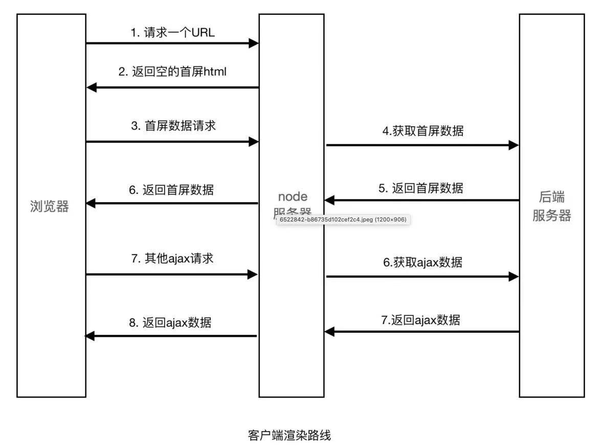
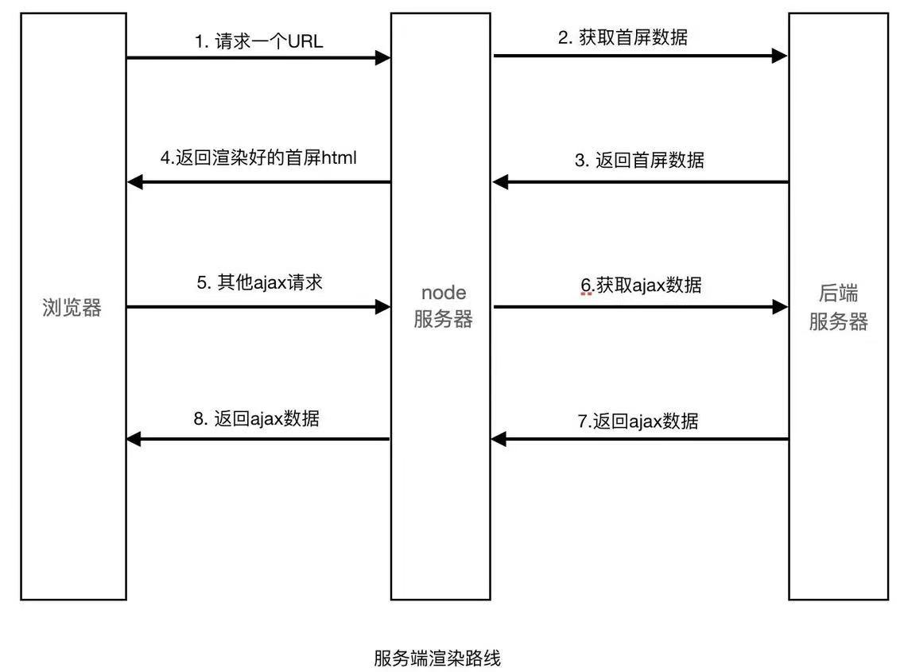
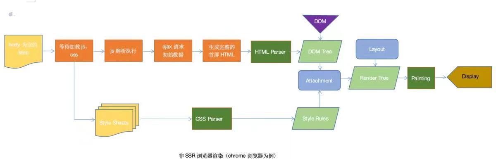
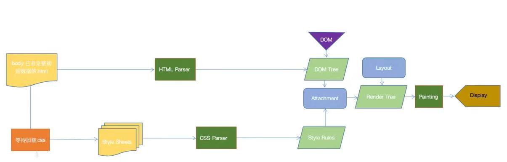

### 1. React组件命名推荐的方式是哪个？

通过引用而不是使用来命名组件displayName。


使用displayName命名组件：

```javascript
export default React.createClass({
  displayName: 'TodoApp',
  // ...
})
```

React推荐的方法：

```javascript
export default class TodoApp extends React.Component {
  // ...
}
```

### 2. react 最新版本解决了什么问题，增加了哪些东西

React 16.x的三大新特性 Time Slicing、Suspense、 hooks

- **Time Slicing（解决CPU速度问题**）使得在执行任务的期间可以随时暂停，跑去干别的事情，这个特性使得react能在性能极其差的机器跑时，仍然保持有良好的性能
- **Suspense （解决网络IO问题）**和lazy配合，实现异步加载组件。 能暂停当前组件的渲染， 当完成某件事以后再继续渲染，解决从react出生到现在都存在的「异步副作用」的问题，而且解决得非的优雅，使用的是 T异步但是同步的写法，这是最好的解决异步问题的方式
- 提供了一个**内置函数componentDidCatch**，当有错误发生时，可以友好地展示 fallback 组件; 可以捕捉到它的子元素（包括嵌套子元素）抛出的异常; 可以复用错误组件。


**（1）React16.8**

加入hooks，让React函数式组件更加灵活，hooks之前，React存在很多问题：

- 在组件间复用状态逻辑很难
- 复杂组件变得难以理解，高阶组件和函数组件的嵌套过深。
- class组件的this指向问题 
- 难以记忆的生命周期


hooks很好的解决了上述问题，hooks提供了很多方法

- useState 返回有状态值，以及更新这个状态值的函数
- useEffect 接受包含命令式，可能有副作用代码的函数。
- useContext 接受上下文对象（从 React.createContext返回的值）并返回当前上下文值，
- useReducer useState 的替代方案。接受类型为 （state，action）=> newState的reducer，并返回与dispatch方法配对的当前状态。
- useCalLback 返回一个回忆的memoized版本，该版本仅在其中一个输入发生更改时才会更改。纯函数的输入输出确定性 o useMemo 纯的一个记忆函数 o useRef 返回一个可变的ref对象，其Current 属性被初始化为传递的参数，返回的 ref 对象在组件的整个生命周期内保持不变。
- useImperativeMethods 自定义使用ref时公开给父组件的实例值
- useMutationEffect 更新兄弟组件之前，它在React执行其DOM改变的同一阶段同步触发
- useLayoutEffect DOM改变后同步触发。使用它来从DOM读取布局并同步重新渲染


**（2）React16.9**

- 重命名 Unsafe 的生命周期方法。新的 UNSAFE_前缀将有助于在代码 review 和 debug 期间，使这些有问题的字样更突出
- 废弃 javascrip:形式的 URL。以javascript:开头的URL 非常容易遭受攻击，造成安全漏洞。
- 废弃"Factory"组件。 工厂组件会导致 React 变大且变慢。
- act（）也支持异步函数，并且你可以在调用它时使用 await。
- 使用 <React.ProfiLer> 进行性能评估。在较大的应用中追踪性能回归可能会很方便 


**（3）React16.13.0**

- 支持在渲染期间调用setState，但仅适用于同一组件
- 可检测冲突的样式规则并记录警告
- 废弃 unstable_createPortal，使用CreatePortal
- 将组件堆栈添加到其开发警告中，使开发人员能够隔离bug并调试其程序，这可以清楚地说明问题所在，并更快地定位和修复错误。

### 3. react 实现一个全局的 dialog

```javascript
import React, { Component } from 'react';
import { is, fromJS } from 'immutable';
import ReactDOM from 'react-dom';
import ReactCSSTransitionGroup from 'react-addons-css-transition-group';
import './dialog.css';
let defaultState = {
  alertStatus:false,
  alertTip:"提示",
  closeDialog:function(){},
  childs:''
}
class Dialog extends Component{
  state = {
    ...defaultState
  };
  // css动画组件设置为目标组件
  FirstChild = props => {
    const childrenArray = React.Children.toArray(props.children);
    return childrenArray[0] || null;
  }
  //打开弹窗
  open =(options)=>{
    options = options || {};
    options.alertStatus = true;
    var props = options.props || {};
    var childs = this.renderChildren(props,options.childrens) || '';
    console.log(childs);
    this.setState({
      ...defaultState,
      ...options,
      childs
    })
  }
  //关闭弹窗
  close(){
    this.state.closeDialog();
    this.setState({
      ...defaultState
    })
  }
  renderChildren(props,childrens) {
    //遍历所有子组件
    var childs = [];
    childrens = childrens || [];
    var ps = {
        ...props,  //给子组件绑定props
        _close:this.close  //给子组件也绑定一个关闭弹窗的事件    
       };
    childrens.forEach((currentItem,index) => {
        childs.push(React.createElement(
            currentItem,
            {
                ...ps,
                key:index
            }
        ));
    })
    return childs;
  }
  shouldComponentUpdate(nextProps, nextState){
    return !is(fromJS(this.props), fromJS(nextProps)) || !is(fromJS(this.state), fromJS(nextState))
  }
   
  render(){
    return (
      <ReactCSSTransitionGroup
        component={this.FirstChild}
        transitionName='hide'
        transitionEnterTimeout={300}
        transitionLeaveTimeout={300}>
        <div className="dialog-con" style={this.state.alertStatus? {display:'block'}:{display:'none'}}>
            {this.state.childs}
        </div>
      </ReactCSSTransitionGroup>
    );
  }
}
let div = document.createElement('div');
let props = {
   
};
document.body.appendChild(div);
let Box = ReactD
```

子类：

```javascript
//子类jsx
import React, { Component } from 'react';
class Child extends Component {
    constructor(props){
        super(props);
        this.state = {date: new Date()};
  }
  showValue=()=>{
    this.props.showValue && this.props.showValue()
  }
  render() {
    return (
      <div className="Child">
        <div className="content">
           Child
           <button onClick={this.showValue}>调用父的方法</button>
        </div>
      </div>
    );
  }
}
export default Child;
```

css：

```css
.dialog-con{
    position: fixed;
    top: 0;
    left: 0;
    width: 100%;
    height: 100%;
    background: rgba(0, 0, 0, 0.3);
}
```

### 4. React 数据持久化有什么实践吗？

封装数据持久化组件：

```javascript
】let storage={
    // 增加
    set(key, value){
        localStorage.setItem(key, JSON.stringify(value));
    },
    // 获取
    get(key){
        return JSON.parse(localStorage.getItem(key));
    },
    // 删除
    remove(key){
        localStorage.removeItem(key);
    }
};
export default Storage;
```

在React项目中，通过redux存储全局数据时，会有一个问题，如果用户刷新了网页，那么通过redux存储的全局数据就会被全部清空，比如登录信息等。这时就会有全局数据持久化存储的需求。首先想到的就是localStorage，localStorage是没有时间限制的数据存储，可以通过它来实现数据的持久化存储。


但是在已经使用redux来管理和存储全局数据的基础上，再去使用localStorage来读写数据，这样不仅是工作量巨大，还容易出错。那么有没有结合redux来达到持久数据存储功能的框架呢？当然，它就是**redux-persist**。redux-persist会将redux的store中的数据缓存到浏览器的localStorage中。其使用步骤如下：


**（1）首先要安装redux-persist：**

```javascript
npm i redux-persist
```

**（2）对于reducer和action的处理不变，只需修改store的生成代码，修改如下：**

```javascript
import {createStore} from 'redux'
import reducers from '../reducers/index'
import {persistStore, persistReducer} from 'redux-persist';
import storage from 'redux-persist/lib/storage';
import autoMergeLevel2 from 'redux-persist/lib/stateReconciler/autoMergeLevel2';
const persistConfig = {
    key: 'root',
    storage: storage,
    stateReconciler: autoMergeLevel2 // 查看 'Merge Process' 部分的具体情况
};
const myPersistReducer = persistReducer(persistConfig, reducers)
const store = createStore(myPersistReducer)
export const persistor = persistStore(store)
export default store
```

**（3）在index.js中，将PersistGate标签作为网页内容的父标签：**

```javascript
import React from 'react';
import ReactDOM from 'react-dom';
import {Provider} from 'react-redux'
import store from './redux/store/store'
import {persistor} from './redux/store/store'
import {PersistGate} from 'redux-persist/lib/integration/react';
ReactDOM.render(<Provider store={store}>
            <PersistGate loading={null} persistor={persistor}>
                {/*网页内容*/}
            </PersistGate>
        </Provider>, document.getElementById('root'));
```

这就完成了通过redux-persist实现React持久化本地数据存储的简单应用。

### 5. 对 React 和 Vue 的理解，它们的异同

**相似之处：**

- 都将注意力集中保持在核心库，而将其他功能如路由和全局状态管理交给相关的库
- 都有自己的构建工具，能让你得到一个根据最佳实践设置的项目模板。
- 都使用了Virtual DOM（虚拟DOM）提高重绘性能
- 都有props的概念，允许组件间的数据传递
- 都鼓励组件化应用，将应用分拆成一个个功能明确的模块，提高复用性


**不同之处：** 

**1）数据流**

Vue默认支持数据双向绑定，而React一直提倡单向数据流 

**2）虚拟DOM**

Vue2.x开始引入"Virtual DOM"，消除了和React在这方面的差异，但是在具体的细节还是有各自的特点。 

- Vue宣称可以更快地计算出Virtual DOM的差异，这是由于它在渲染过程中，会跟踪每一个组件的依赖关系，不需要重新渲染整个组件树。
- 对于React而言，每当应用的状态被改变时，全部子组件都会重新渲染。当然，这可以通过 PureComponent/shouldComponentUpdate这个生命周期方法来进行控制，但Vue将此视为默认的优化。

**3）组件化**

React与Vue最大的不同是模板的编写。

- Vue鼓励写近似常规HTML的模板。写起来很接近标准 HTML元素，只是多了一些属性。
- React推荐你所有的模板通用JavaScript的语法扩展——JSX书写。


具体来讲：React中render函数是支持闭包特性的，所以我们import的组件在render中可以直接调用。但是在Vue中，由于模板中使用的数据都必须挂在 this 上进行一次中转，所以 import 完组件之后，还需要在 components 中再声明下。

**4）监听数据变化的实现原理不同**

- Vue 通过 getter/setter 以及一些函数的劫持，能精确知道数据变化，不需要特别的优化就能达到很好的性能
- React 默认是通过比较引用的方式进行的，如果不优化（PureComponent/shouldComponentUpdate）可能导致大量不必要的vDOM的重新渲染。这是因为 Vue 使用的是可变数据，而React更强调数据的不可变。

**5）高阶组件**

react可以通过高阶组件（Higher Order Components-- HOC）来扩展，而vue需要通过mixins来扩展。


原因高阶组件就是高阶函数，而React的组件本身就是纯粹的函数，所以高阶函数对React来说易如反掌。相反Vue.js使用HTML模板创建视图组件，这时模板无法有效的编译，因此Vue不采用HOC来实现。

**6）构建工具**

两者都有自己的构建工具

- React ==> Create React APP
- Vue ==> vue-cli

**7）跨平台**

- React ==> React Native
- Vue ==> Weex

### 6. 可以使用TypeScript写React应用吗？怎么操作？

**（1）如果还未创建 Create React App 项目**

- 直接创建一个具有 typescript 的 Create React App 项目：

```javascript
 npx create-react-app demo --typescript
```

**（2）如果已经创建了 Create React App 项目，需要将 typescript 引入到已有项目中**

- 通过命令将 typescript 引入项目：

```javascript
npm install --save typescript @types/node @types/react @types/react-dom @types/jest
```

- 将项目中任何 后缀名为 ‘.js’ 的 JavaScript 文件重命名为 TypeScript 文件即后缀名为 ‘.tsx’（例如 src/index.js 重命名为 src/index.tsx ）

### 7. React 设计思路，它的理念是什么？

**（1）编写简单直观的代码**

React最大的价值不是高性能的虚拟DOM、封装的事件机制、服务器端渲染，而是声明式的直观的编码方式。react文档第一条就是声明式，React 使创建交互式 UI 变得轻而易举。为应用的每一个状态设计简洁的视图，当数据改变时 React 能有效地更新并正确地渲染组件。 以声明式编写 UI，可以让代码更加可靠，且方便调试。


**（2）简化可复用的组件**

React框架里面使用了简化的组件模型，但更彻底地使用了组件化的概念。React将整个UI上的每一个功能模块定义成组件，然后将小的组件通过组合或者嵌套的方式构成更大的组件。React的组件具有如下的特性∶

- 可组合：简单组件可以组合为复杂的组件
- 可重用：每个组件都是独立的，可以被多个组件使用 
- 可维护：和组件相关的逻辑和UI都封装在了组件的内部，方便维护

- 可测试：因为组件的独立性，测试组件就变得方便很多。


**（3) Virtual DOM**

真实页面对应一个 DOM 树。在传统页面的开发模式中，每次需要更新页面时，都要手动操作 DOM 来进行更新。 DOM 操作非常昂贵。在前端开发中，性能消耗最大的就是 DOM 操作，而且这部分代码会让整体项目的代码变得难 以维护。React 把真实 DOM 树转换成 JavaScript 对象树，也就是 Virtual DOM，每次数据更新后，重新计算 Virtual DOM，并和上一次生成的 Virtual DOM 做对比，对发生变化的部分做批量更新。React 也提供了直观的 shouldComponentUpdate 生命周期回调，来减少数据变化后不必要的 Virtual DOM 对比过程，以保证性能。


**（4）函数式编程**

React 把过去不断重复构建 UI 的过程抽象成了组件，且在给定参数的情况下约定渲染对应的 UI 界面。React 能充分利用很多函数式方法去减少冗余代码。此外，由于它本身就是简单函数，所以易于测试。


**（5）一次学习，随处编写**

无论现在正在使用什么技术栈，都可以随时引入 React来开发新特性，而不需要重写现有代码。

React 还可以使用 Node 进行服务器渲染，或使用 React Native 开发原生移动应用。因为 React 组件可以映射为对应的原生控件。在输出的时候，是输出 Web DOM，还是 Android 控件，还是 iOS 控件，就由平台本身决定了。所以，react很方便和其他平台集成

### 8. React中props.children和React.Children的区别

在React中，当涉及组件嵌套，在父组件中使用`props.children`把所有子组件显示出来。如下：

```javascript
function ParentComponent(props){
	return (
		<div>
			{props.children}
		</div>
	)
}
```

如果想把父组件中的属性传给所有的子组件，需要使用`React.Children`方法。


比如，把几个Radio组合起来，合成一个RadioGroup，这就要求所有的Radio具有同样的name属性值。可以这样：把Radio看做子组件，RadioGroup看做父组件，name的属性值在RadioGroup这个父组件中设置。


首先是子组件：

```javascript
//子组件
function RadioOption(props) {
  return (
    <label>
      <input type="radio" value={props.value} name={props.name} />
      {props.label}
    </label>
  )
}
```

然后是父组件，不仅需要把它所有的子组件显示出来，还需要为每个子组件赋上name属性和值：

```javascript
//父组件用,props是指父组件的props
function renderChildren(props) {
    
  //遍历所有子组件
  return React.Children.map(props.children, child => {
    if (child.type === RadioOption)
      return React.cloneElement(child, {
        //把父组件的props.name赋值给每个子组件
        name: props.name
      })
    else
      return child
  })
}
//父组件
function RadioGroup(props) {
  return (
    <div>
      {renderChildren(props)}
    </div>
  )
}
function App() {
  return (
    <RadioGroup name="hello">
      <RadioOption label="选项一" value="1" />
      <RadioOption label="选项二" value="2" />
      <RadioOption label="选项三" value="3" />
    </RadioGroup>
  )
}
export default App;
```

以上，`React.Children.map`让我们对父组件的所有子组件又更灵活的控制。

### 9. React的状态提升是什么？使用场景有哪些？

React的状态提升就是用户对子组件操作，子组件不改变自己的状态，通过自己的props把这个操作改变的数据传递给父组件，改变父组件的状态，从而改变受父组件控制的所有子组件的状态，这也是React单项数据流的特性决定的。官方的原话是：共享 state(状态) 是通过将其移动到需要它的组件的最接近的共同祖先组件来实现的。 这被称为“状态提升(Lifting State Up)”。


概括来说就是**将多个组件需要共享的状态提升到它们最近的父组件上**，**在父组件上改变这个状态然后通过props分发给子组件。**


一个简单的例子，父组件中有两个input子组件，如果想在第一个输入框输入数据，来改变第二个输入框的值，这就需要用到状态提升。

```javascript
class Father extends React.Component {
    constructor(props) {
        super(props)
        this.state = {
            Value1: '',
            Value2: ''
        }
    }
    value1Change(aa) {
        this.setState({
            Value1: aa
        })
    }
    value2Change(bb) {
        this.setState({
            Value2: bb
        })
    }
    render() {
        return (
            <div style={{ padding: "100px" }}>
                <Child1 value1={this.state.Value1} onvalue1Change={this.value1Change.bind(this)} />
                <br />
                <Child2 value2={this.state.Value1} />
            </div>
        )
    }
}
class Child1 extends React.Component {
    constructor(props) {
        super(props)
    }
    changeValue(e) {
        this.props.onvalue1Change(e.target.value)
    }
    render() {
        return (
            <input value={this.props.Value1} onChange={this.changeValue.bind(this)} />
        )
    }
}
class Child2 extends React.Component {
    constructor(props) {
        super(props)
    }
    render() {
        return (
            <input value={this.props.value2} />
        )
    }
}
 
ReactDOM.render(
    <Father />,
    document.getElementById('root')
)
```

### 10. React中constructor和getInitialState的区别?

两者都是用来初始化state的。前者是ES6中的语法，后者是ES5中的语法，新版本的React中已经废弃了该方法。


getInitialState是ES5中的方法，如果使用createClass方法创建一个Component组件，可以自动调用它的getInitialState方法来获取初始化的State对象，

```javascript
var APP = React.creatClass ({
  getInitialState() {
    return { 
        userName: 'hi',
        userId: 0
     };
　}
})
```

React在ES6的实现中去掉了getInitialState这个hook函数，规定state在constructor中实现，如下：

```javascript
Class App extends React.Component{
    constructor(props){
      super(props);
      this.state={};
    }
  }
```

### 11. React的严格模式如何使用，有什么用处？

`StrictMode` 是一个用来突出显示应用程序中潜在问题的工具。与 `Fragment` 一样，`StrictMode` 不会渲染任何可见的 UI。它为其后代元素触发额外的检查和警告。

可以为应用程序的任何部分启用严格模式。例如：

```javascript
import React from 'react';
function ExampleApplication() {
  return (
    <div>
      <Header />
      <React.StrictMode>        
        <div>
          <ComponentOne />
          <ComponentTwo />
        </div>
      </React.StrictMode>      
      <Footer />
    </div>
  );
}
```

在上述的示例中，*不*会对 `Header` 和 `Footer` 组件运行严格模式检查。但是，`ComponentOne` 和 `ComponentTwo` 以及它们的所有后代元素都将进行检查。


`StrictMode` 目前有助于：

- 识别不安全的生命周期
- 关于使用过时字符串 ref API 的警告
- 关于使用废弃的 findDOMNode 方法的警告
- 检测意外的副作用
- 检测过时的 context API

### 12. 在React中遍历的方法有哪些？

**（1）遍历数组：map && forEach**

```javascript
import React from 'react';

class App extends React.Component {
  render() {
    let arr = ['a', 'b', 'c', 'd'];
    return (
      <ul>
        {
          arr.map((item, index) => {
            return <li key={index}>{item}</li>
          })
        }
      </ul>
    )
  }
}

class App extends React.Component {
  render() {
    let arr = ['a', 'b', 'c', 'd'];
    return (
      <ul>
        {
          arr.forEach((item, index) => {
            return <li key={index}>{item}</li>
          })
        }
      </ul>
    )
  }
}
```

**（2）遍历对象：map && for in**

```javascript
class App extends React.Component {
  render() {
    let obj = {
      a: 1,
      b: 2,
      c: 3
    }
    return (
      <ul>
        {
          (() => {
            let domArr = [];
            for(const key in obj) {
              if(obj.hasOwnProperty(key)) {
                const value = obj[key]
                domArr.push(<li key={key}>{value}</li>)
              }
            }
            return domArr;
          })()
        }
      </ul>
    )
  }
}

// Object.entries() 把对象转换成数组
class App extends React.Component {
  render() {
    let obj = {
      a: 1,
      b: 2,
      c: 3
    }
    return (
      <ul>
        {
          Object.entries(obj).map(([key, value], index) => {   // item是一个数组，把item解构，写法是[key, value]
            return <li key={key}>{value}</li>
          }) 
        }
      </ul>
    )
  }
}
```

### 13. 在React中页面重新加载时怎样保留数据？

这个问题就设计到了**数据持久化，**主要的实现方式有以下几种：

- **Redux：**将页面的数据存储在redux中，在重新加载页面时，获取Redux中的数据；
- **data.js：**使用webpack构建的项目，可以建一个文件，data.js，将数据保存data.js中，跳转页面后获取；
- **sessionStorge：**在进入选择地址页面之前，componentWillUnMount的时候，将数据存储到sessionStorage中，每次进入页面判断sessionStorage中有没有存储的那个值，有，则读取渲染数据；没有，则说明数据是初始化的状态。返回或进入除了选择地址以外的页面，清掉存储的sessionStorage，保证下次进入是初始化的数据
- **history API：**History API 的 `pushState` 函数可以给历史记录关联一个任意的可序列化 `state`，所以可以在路由 `push` 的时候将当前页面的一些信息存到 `state` 中，下次返回到这个页面的时候就能从 `state` 里面取出离开前的数据重新渲染。react-router 直接可以支持。这个方法适合一些需要临时存储的场景。

### 14. 同时引用这三个库react.js、react-dom.js和babel.js它们都有什么作用？

- react：包含react所必须的核心代码
- react-dom：react渲染在不同平台所需要的核心代码
- babel：将jsx转换成React代码的工具 

### 15. React必须使用JSX吗？

React 并不强制要求使用 JSX。当不想在构建环境中配置有关 JSX 编译时，不在 React 中使用 JSX 会更加方便。


每个 JSX 元素只是调用 `React.createElement(component, props, ...children)` 的语法糖。因此，使用 JSX 可以完成的任何事情都可以通过纯 JavaScript 完成。


例如，用 JSX 编写的代码：

```javascript
class Hello extends React.Component {
  render() {
    return <div>Hello {this.props.toWhat}</div>;
  }
}
ReactDOM.render(
  <Hello toWhat="World" />,
  document.getElementById('root')
);
```

可以编写为不使用 JSX 的代码：

```javascript
class Hello extends React.Component {
  render() {
    return React.createElement('div', null, `Hello ${this.props.toWhat}`);
  }
}
ReactDOM.render(
  React.createElement(Hello, {toWhat: 'World'}, null),
  document.getElementById('root')
);
```

### 16. 为什么使用jsx的组件中没有看到使用react却需要引入react？

本质上来说JSX是`React.createElement(component, props, ...children)`方法的语法糖。在React 17之前，如果使用了JSX，其实就是在使用React， `babel` 会把组件转换为 `CreateElement` 形式。在React 17之后，就不再需要引入，因为 `babel` 已经可以帮我们自动引入react。

### 17. 在React中怎么使用async/await？

async/await是ES7标准中的新特性。如果是使用React官方的脚手架创建的项目，就可以直接使用。如果是在自己搭建的webpack配置的项目中使用，可能会遇到 **regeneratorRuntime is not defined** 的异常错误。那么我们就需要引入babel，并在babel中配置使用async/await。可以利用babel的 transform-async-to-module-method 插件来转换其成为浏览器支持的语法，虽然没有性能的提升，但对于代码编写体验要更好。

### 18. React.Children.map和js的map有什么区别？

JavaScript中的map不会对为null或者undefined的数据进行处理，而React.Children.map中的map可以处理React.Children为null或者undefined的情况。

### 19. 对React SSR的理解

服务端渲染是数据与模版组成的html，即 HTML = 数据 ＋ 模版。将组件或页面通过服务器生成html字符串，再发送到浏览器，最后将静态标记"混合"为客户端上完全交互的应用程序。页面没使用服务渲染，当请求页面时，返回的body里为空，之后执行js将html结构注入到body里，结合css显示出来;


**SSR的优势：**

- 对SEO友好
- 所有的模版、图片等资源都存在服务器端 
- 一个html返回所有数据 
- 减少HTTP请求
- 响应快、用户体验好、首屏渲染快 


**1）更利于SEO**

不同爬虫工作原理类似，只会爬取源码，不会执行网站的任何脚本使用了React或者其它MVVM框架之后，页面大多数DOM元素都是在客户端根据js动态生成，可供爬虫抓取分析的内容大大减少。另外，浏览器爬虫不会等待我们的数据完成之后再去抓取页面数据。服务端渲染返回给客户端的是已经获取了异步数据并执行JavaScript脚本的最终HTML，网络爬中就可以抓取到完整页面的信息。

**2）更利于首屏渲染**

首屏的渲染是node发送过来的html字符串，并不依赖于js文件了，这就会使用户更快的看到页面的内容。尤其是针对大型单页应用，打包后文件体积比较大，普通客户端渲染加载所有所需文件时间较长，首页就会有一个很长的白屏等待时间。


**SSR的局限：**

**1）服务端压力较大**

本来是通过客户端完成渲染，现在统一到服务端node服务去做。尤其是高并发访问的情况，会大量占用服务端CPU资源;

**2）开发条件受限**

在服务端渲染中，只会执行到componentDidMount之前的生命周期钩子，因此项目引用的第三方的库也不可用其它生命周期钩子，这对引用库的选择产生了很大的限制; 

**3）学习成本相对较高**

除了对webpack、MVVM框架要熟悉，还需要掌握node、 Koa2等相关技术。相对于客户端渲染，项目构建、部署过程更加复杂。


**时间耗时比较：**

**1）数据请求**

由服务端请求首屏数据，而不是客户端请求首屏数据，这是"快"的一个主要原因。服务端在内网进行请求，数据响应速度快。客户端在不同网络环境进行数据请求，且外网http请求开销大，导致时间差 

- 客户端数据请求




- 服务端数据请求



**2）html渲染**

服务端渲染是先向后端服务器请求数据，然后生成完整首屏 html返回给浏览器；而客户端渲染是等js代码下载、加载、解析完成后再请求数据渲染，等待的过程页面是什么都没有的，就是用户看到的白屏。就是服务端渲染不需要等待js代码下载完成并请求数据，就可以返回一个已有完整数据的首屏页面。

- 非ssr html渲染



- ssr html渲染



### 20. 为什么 React 要用 JSX？

JSX 是一个 JavaScript 的语法扩展，或者说是一个类似于 XML 的 ECMAScript 语法扩展。它本身没有太多的语法定义，也不期望引入更多的标准。


其实 React 本身并不强制使用 JSX。在没有 JSX 的时候，React 实现一个组件依赖于使用 React.createElement 函数。代码如下：

```javascript
class Hello extends React.Component {
  render() {
    return React.createElement(
        'div',
        null, 
        `Hello ${this.props.toWhat}`
      );
  }
}
ReactDOM.render(
  React.createElement(Hello, {toWhat: 'World'}, null),
  document.getElementById('root')
);
```

而 JSX 更像是一种语法糖，通过类似 XML 的描述方式，描写函数对象。在采用 JSX 之后，这段代码会这样写：

```javascript
class Hello extends React.Component {
  render() {
    return <div>Hello {this.props.toWhat}</div>;
  }
}
ReactDOM.render(
  <Hello toWhat="World" />,
  document.getElementById('root')
);
```

通过对比，可以清晰地发现，代码变得更为简洁，而且代码结构层次更为清晰。


因为 React 需要将组件转化为虚拟 DOM 树，所以在编写代码时，实际上是在手写一棵结构树。而**XML 在树结构的描述上天生具有可读性强的优势。**


但这样可读性强的代码仅仅是给写程序的同学看的，实际上在运行的时候，会使用 Babel 插件将 JSX 语法的代码还原为 React.createElement 的代码。


**总结：**

JSX 是一个 JavaScript 的语法扩展，结构类似 XML。JSX 主要用于声明 React 元素，但 React 中并不强制使用 JSX。即使使用了 JSX，也会在构建过程中，通过 Babel 插件编译为 React.createElement。所以 JSX 更像是 React.createElement 的一种语法糖。


React 团队并不想引入 JavaScript 本身以外的开发体系。而是希望通过合理的关注点分离保持组件开发的纯粹性。

### 21. HOC相比 mixins 有什么优点？

HOC 和 Vue 中的 mixins 作用是一致的，并且在早期 React 也是使用 mixins 的方式。但是在使用 class 的方式创建组件以后，mixins 的方式就不能使用了，并且其实 mixins 也是存在一些问题的，比如：

- 隐含了一些依赖，比如我在组件中写了某个 `state` 并且在 `mixin` 中使用了，就这存在了一个依赖关系。万一下次别人要移除它，就得去 `mixin` 中查找依赖
- 多个 `mixin` 中可能存在相同命名的函数，同时代码组件中也不能出现相同命名的函数，否则就是重写了，其实我一直觉得命名真的是一件麻烦事。。
- 雪球效应，虽然我一个组件还是使用着同一个 `mixin`，但是一个 `mixin` 会被多个组件使用，可能会存在需求使得 `mixin` 修改原本的函数或者新增更多的函数，这样可能就会产生一个维护成本


HOC 解决了这些问题，并且它们达成的效果也是一致的，同时也更加的政治正确（毕竟更加函数式了）。

### 22. React 中的高阶组件运用了什么设计模式？

使用了装饰模式，高阶组件的运用：

```javascript
function withWindowWidth(BaseComponent) {
  class DerivedClass extends React.Component {
    state = {
      windowWidth: window.innerWidth,
    }
    onResize = () => {
      this.setState({
        windowWidth: window.innerWidth,
      })
    }
    componentDidMount() {
      window.addEventListener('resize', this.onResize)
    }
    componentWillUnmount() {
      window.removeEventListener('resize', this.onResize);
    }
    render() {
      return <BaseComponent {...this.props} {...this.state}/>
    }
  }
  return DerivedClass;
}
const MyComponent = (props) => {
  return <div>Window width is: {props.windowWidth}</div>
};
export default withWindowWidth(MyComponent);
```

装饰模式的特点是不需要改变 被装饰对象 本身，而只是在外面套一个外壳接口。JavaScript 目前已经有了原生装饰器的提案，其用法如下：

```javascript
@testable
   class MyTestableClass {
}
```

