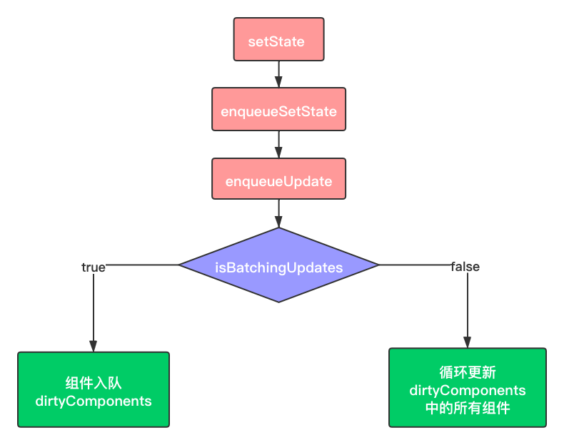

### 1. React setState 调用的原理



具体的执行过程如下（源码级解析）：

- 首先调用了`setState` 入口函数，入口函数在这里就是充当一个分发器的角色，根据入参的不同，将其分发到不同的功能函数中去；

```javascript
ReactComponent.prototype.setState = function (partialState, callback) {
  this.updater.enqueueSetState(this, partialState);
  if (callback) {
    this.updater.enqueueCallback(this, callback, 'setState');
  }
};
```

- `enqueueSetState` 方法将新的 `state` 放进组件的状态队列里，并调用 `enqueueUpdate` 来处理将要更新的实例对象；

```javascript
enqueueSetState: function (publicInstance, partialState) {
  // 根据 this 拿到对应的组件实例
  var internalInstance = getInternalInstanceReadyForUpdate(publicInstance, 'setState');
  // 这个 queue 对应的就是一个组件实例的 state 数组
  var queue = internalInstance._pendingStateQueue || (internalInstance._pendingStateQueue = []);
  queue.push(partialState);
  //  enqueueUpdate 用来处理当前的组件实例
  enqueueUpdate(internalInstance);
}
```

-  在 `enqueueUpdate` 方法中引出了一个关键的对象——`batchingStrategy`，该对象所具备的`isBatchingUpdates` 属性直接决定了当下是要走更新流程，还是应该排队等待；如果轮到执行，就调用 `batchedUpdates` 方法来直接发起更新流程。由此可以推测，`batchingStrategy` 或许正是 React 内部专门用于管控批量更新的对象。

```javascript
function enqueueUpdate(component) {
  ensureInjected();
  // 注意这一句是问题的关键，isBatchingUpdates标识着当前是否处于批量创建/更新组件的阶段
  if (!batchingStrategy.isBatchingUpdates) {
    // 若当前没有处于批量创建/更新组件的阶段，则立即更新组件
    batchingStrategy.batchedUpdates(enqueueUpdate, component);
    return;
  }
  // 否则，先把组件塞入 dirtyComponents 队列里，让它“再等等”
  dirtyComponents.push(component);
  if (component._updateBatchNumber == null) {
    component._updateBatchNumber = updateBatchNumber + 1;
  }
}
```

**注意：**`batchingStrategy` 对象可以理解为“锁管理器”。这里的“锁”，是指 React 全局唯一的 `isBatchingUpdates` 变量，`isBatchingUpdates` 的初始值是 `false`，意味着“当前并未进行任何批量更新操作”。每当 React 调用 `batchedUpdate` 去执行更新动作时，会先把这个锁给“锁上”（置为 `true`），表明“现在正处于批量更新过程中”。当锁被“锁上”的时候，任何需要更新的组件都只能暂时进入 `dirtyComponents` 里排队等候下一次的批量更新，而不能随意“插队”。此处体现的“任务锁”的思想，是 React 面对大量状态仍然能够实现有序分批处理的基石。

### 2. React setState 调用之后发生了什么？是同步还是异步？

**（1）React中setState后发生了什么**

在代码中调用setState函数之后，React 会将传入的参数对象与组件当前的状态合并，然后触发调和过程(Reconciliation)。经过调和过程，React 会以相对高效的方式根据新的状态构建 React 元素树并且着手重新渲染整个UI界面。


在 React 得到元素树之后，React 会自动计算出新的树与老树的节点差异，然后根据差异对界面进行最小化重渲染。在差异计算算法中，React 能够相对精确地知道哪些位置发生了改变以及应该如何改变，这就保证了按需更新，而不是全部重新渲染。


如果在短时间内频繁setState。React会将state的改变压入栈中，在合适的时机，批量更新state和视图，达到提高性能的效果。


**（2）setState 是同步还是异步的**

假如所有setState是同步的，意味着每执行一次setState时（有可能一个同步代码中，多次setState），都重新vnode diff + dom修改，这对性能来说是极为不好的。如果是异步，则可以把一个同步代码中的多个setState合并成一次组件更新。所以默认是异步的，但是在一些情况下是同步的。


setState 并不是单纯同步/异步的，它的表现会因调用场景的不同而不同。在源码中，通过 isBatchingUpdates 来判断setState 是先存进 state 队列还是直接更新，如果值为 true 则执行异步操作，为 false 则直接更新。

- **异步：**在 React 可以控制的地方，就为 true，比如在 React 生命周期事件和合成事件中，都会走合并操作，延迟更新的策略。
- **同步：**在 React 无法控制的地方，比如原生事件，具体就是在 addEventListener 、setTimeout、setInterval 等事件中，就只能同步更新。


一般认为，做异步设计是为了性能优化、减少渲染次数：

- `setState`设计为异步，可以显著的提升性能。如果每次调用 `setState`都进行一次更新，那么意味着`render`函数会被频繁调用，界面重新渲染，这样效率是很低的；最好的办法应该是获取到多个更新，之后进行批量更新； 
- 如果同步更新了`state`，但是还没有执行`render`函数，那么`state`和`props`不能保持同步。`state`和`props`不能保持一致性，会在开发中产生很多的问题；

### 3. React中的setState批量更新的过程是什么？

调用 `setState` 时，组件的 `state` 并不会立即改变， `setState` 只是把要修改的 `state` 放入一个队列， `React` 会优化真正的执行时机，并出于性能原因，会将 `React` 事件处理程序中的多次`React` 事件处理程序中的多次 `setState` 的状态修改合并成一次状态修改。 最终更新只产生一次组件及其子组件的重新渲染，这对于大型应用程序中的性能提升至关重要。

```javascript
this.setState({
  count: this.state.count + 1    ===>    入队，[count+1的任务]
});
this.setState({
  count: this.state.count + 1    ===>    入队，[count+1的任务，count+1的任务]
});
                                          ↓
                                         合并 state，[count+1的任务]
                                          ↓
                                         执行 count+1的任务
```

需要注意的是，只要同步代码还在执行，“攒起来”这个动作就不会停止。（注：这里之所以多次 +1 最终只有一次生效，是因为在同一个方法中多次 setState 的合并动作不是单纯地将更新累加。比如这里对于相同属性的设置，React 只会为其保留最后一次的更新）。

### 4.  React中有使用过getDefaultProps吗？它有什么作用？

通过实现组件的getDefaultProps，对属性设置默认值（ES5的写法）：

```javascript
var ShowTitle = React.createClass({
  getDefaultProps:function(){
    return{
      title : "React"
    }
  },
  render : function(){
    return <h1>{this.props.title}</h1>
  }
});
```

### 5. React中setState的第二个参数作用是什么？

`setState` 的第二个参数是一个可选的回调函数。这个回调函数将在组件重新渲染后执行。等价于在 `componentDidUpdate` 生命周期内执行。通常建议使用 `componentDidUpdate` 来代替此方式。在这个回调函数中你可以拿到更新后 `state` 的值：

```javascript
this.setState({
    key1: newState1,
    key2: newState2,
    ...
}, callback) // 第二个参数是 state 更新完成后的回调函数
```

### 6. React中的setState和replaceState的区别是什么？

**（1）****setState()**

setState()用于设置状态对象，其语法如下：

```javascript
setState(object nextState[, function callback])
```

- nextState，将要设置的新状态，该状态会和当前的state合并
- callback，可选参数，回调函数。该函数会在setState设置成功，且组件重新渲染后调用。


合并nextState和当前state，并重新渲染组件。setState是React事件处理函数中和请求回调函数中触发UI更新的主要方法。


**（2）****replaceState()**

replaceState()方法与setState()类似，但是方法只会保留nextState中状态，原state不在nextState中的状态都会被删除。其语法如下：

```javascript
replaceState(object nextState[, function callback])
```

- nextState，将要设置的新状态，该状态会替换当前的state。
- callback，可选参数，回调函数。该函数会在replaceState设置成功，且组件重新渲染后调用。


**总结：**setState 是修改其中的部分状态，相当于 Object.assign，只是覆盖，不会减少原来的状态。而replaceState 是完全替换原来的状态，相当于赋值，将原来的 state 替换为另一个对象，如果新状态属性减少，那么 state 中就没有这个状态了。

### 7. 在React中组件的this.state和setState有什么区别？

this.state通常是用来初始化state的，this.setState是用来修改state值的。如果初始化了state之后再使用this.state，之前的state会被覆盖掉，如果使用this.setState，只会替换掉相应的state值。所以，如果想要修改state的值，就需要使用setState，而不能直接修改state，直接修改state之后页面是不会更新的。

### 8. state 是怎么注入到组件的，从 reducer 到组件经历了什么样的过程

通过connect和mapStateToProps将state注入到组件中：

```javascript
import { connect } from 'react-redux'
import { setVisibilityFilter } from '@/reducers/Todo/actions'
import Link from '@/containers/Todo/components/Link'

const mapStateToProps = (state, ownProps) => ({
    active: ownProps.filter === state.visibilityFilter
})

const mapDispatchToProps = (dispatch, ownProps) => ({
    setFilter: () => {
        dispatch(setVisibilityFilter(ownProps.filter))
    }
})

export default connect(
    mapStateToProps,
    mapDispatchToProps
)(Link)
```

上面代码中，active就是注入到Link组件中的状态。 mapStateToProps（state，ownProps）中带有两个参数，含义是∶

- state-store管理的全局状态对象，所有都组件状态数据都存储在该对象中。
- ownProps 组件通过props传入的参数。 


**reducer 到组件经历的过程：**

- reducer对action对象处理，更新组件状态，并将新的状态值返回store。
- 通过connect（mapStateToProps，mapDispatchToProps）（Component）对组件 Component进行升级，此时将状态值从store取出并作为props参数传递到组件。


**高阶组件实现源码∶**

```javascript
import React from 'react'
import PropTypes from 'prop-types'

// 高阶组件 contect 
export const connect = (mapStateToProps, mapDispatchToProps) => (WrappedComponent) => {
    class Connect extends React.Component {
        // 通过对context调用获取store
        static contextTypes = {
            store: PropTypes.object
        }

        constructor() {
            super()
            this.state = {
                allProps: {}
            }
        }

        // 第一遍需初始化所有组件初始状态
        componentWillMount() {
            const store = this.context.store
            this._updateProps()
            store.subscribe(() => this._updateProps()); // 加入_updateProps()至store里的监听事件列表
        }

        // 执行action后更新props，使组件可以更新至最新状态（类似于setState）
        _updateProps() {
            const store = this.context.store;
            let stateProps = mapStateToProps ?
                mapStateToProps(store.getState(), this.props) : {} // 防止 mapStateToProps 没有传入
            let dispatchProps = mapDispatchToProps ?
                mapDispatchToProps(store.dispatch, this.props) : {
                                    dispatch: store.dispatch
                                } // 防止 mapDispatchToProps 没有传入
            this.setState({
                allProps: {
                    ...stateProps,
                    ...dispatchProps,
                    ...this.props
                }
            })
        }

        render() {
            return <WrappedComponent {...this.state.allProps} />
        }
    }
    return Connect
}
```

### 9. React组件的state和props有什么区别？

**（1）props**

props是一个从外部传进组件的参数，主要作为就是从父组件向子组件传递数据，它具有可读性和不变性，只能通过外部组件主动传入新的props来重新渲染子组件，否则子组件的props以及展现形式不会改变。

**（2）state**

state的主要作用是用于组件保存、控制以及修改自己的状态，它只能在constructor中初始化，它算是组件的私有属性，不可通过外部访问和修改，只能通过组件内部的this.setState来修改，修改state属性会导致组件的重新渲染。

**（3）区别**

- props 是传递给组件的（类似于函数的形参），而state 是在组件内被组件自己管理的（类似于在一个函数内声明的变量）。
- props 是不可修改的，所有 React 组件都必须像纯函数一样保护它们的 props 不被更改。
- state 是在组件中创建的，一般在 constructor中初始化 state。state 是多变的、可以修改，每次setState都异步更新的。

### 10. React中的props为什么是只读的？

`this.props`是组件之间沟通的一个接口，原则上来讲，它只能从父组件流向子组件。React具有浓重的函数式编程的思想。


提到函数式编程就要提一个概念：纯函数。它有几个特点：

- 给定相同的输入，总是返回相同的输出。
- 过程没有副作用。
- 不依赖外部状态。


`this.props`就是汲取了纯函数的思想。props的不可以变性就保证的相同的输入，页面显示的内容是一样的，并且不会产生副作用

### 11. 在React中组件的props改变时更新组件的有哪些方法？

在一个组件传入的props更新时重新渲染该组件常用的方法是在`componentWillReceiveProps`中将新的props更新到组件的state中（这种state被成为派生状态（Derived State）），从而实现重新渲染。React 16.3中还引入了一个新的钩子函数`getDerivedStateFromProps`来专门实现这一需求。


**（1）****componentWillReceiveProps（已废弃）**

在react的componentWillReceiveProps(nextProps)生命周期中，可以在子组件的render函数执行前，通过this.props获取旧的属性，通过nextProps获取新的props，对比两次props是否相同，从而更新子组件自己的state。


这样的好处是，可以将数据请求放在这里进行执行，需要传的参数则从componentWillReceiveProps(nextProps)中获取。而不必将所有的请求都放在父组件中。于是该请求只会在该组件渲染时才会发出，从而减轻请求负担。

**（2）****getDerivedStateFromProps（16.3引入）**

这个生命周期函数是为了替代`componentWillReceiveProps`存在的，所以在需要使用`componentWillReceiveProps`时，就可以考虑使用`getDerivedStateFromProps`来进行替代。


两者的参数是不相同的，而`getDerivedStateFromProps`是一个静态函数，也就是这个函数不能通过this访问到class的属性，也并不推荐直接访问属性。而是应该通过参数提供的nextProps以及prevState来进行判断，根据新传入的props来映射到state。


需要注意的是，**如果props传入的内容不需要影响到你的state，那么就需要返回一个null**，这个返回值是必须的，所以尽量将其写到函数的末尾：

```javascript
static getDerivedStateFromProps(nextProps, prevState) {
    const {type} = nextProps;
    // 当传入的type发生变化的时候，更新state
    if (type !== prevState.type) {
        return {
            type,
        };
    }
    // 否则，对于state不进行任何操作
    return null;
}
```

### 12. React中怎么检验props？验证props的目的是什么？

**React**为我们提供了**PropTypes**以供验证使用。当我们向**Props**传入的数据无效（向Props传入的数据类型和验证的数据类型不符）就会在控制台发出警告信息。它可以避免随着应用越来越复杂从而出现的问题。并且，它还可以让程序变得更易读。

```javascript
import PropTypes from 'prop-types';

class Greeting extends React.Component {
  render() {
    return (
      <h1>Hello, {this.props.name}</h1>
    );
  }
}

Greeting.propTypes = {
  name: PropTypes.string
};
```

当然，如果项目汇中使用了TypeScript，那么就可以不用PropTypes来校验，而使用TypeScript定义接口来校验props。